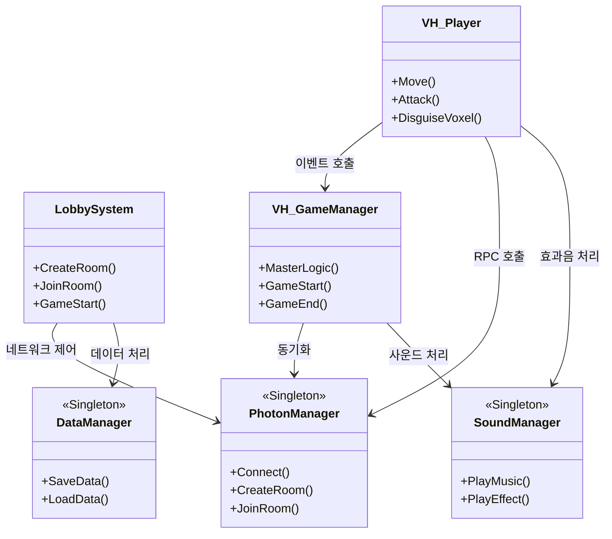
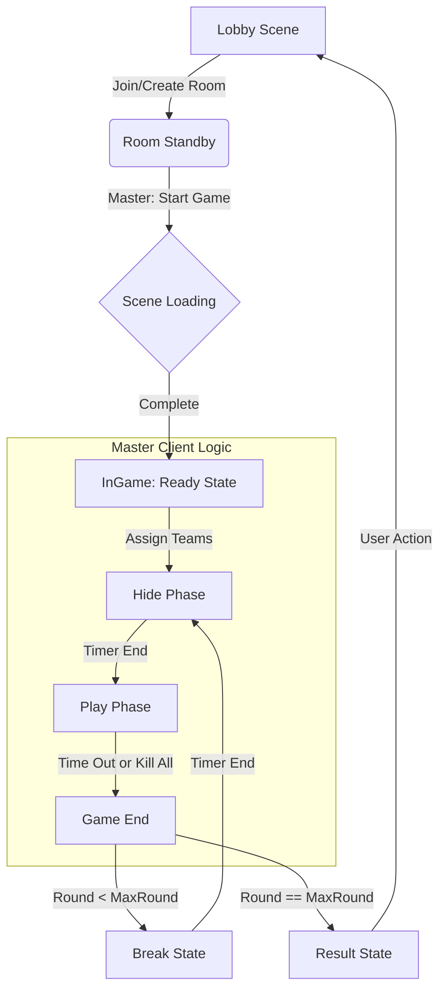
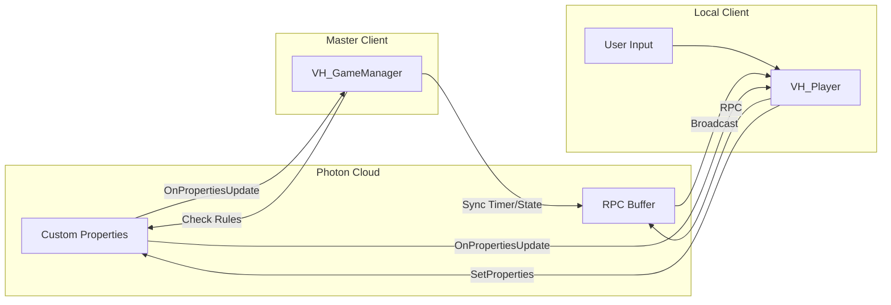
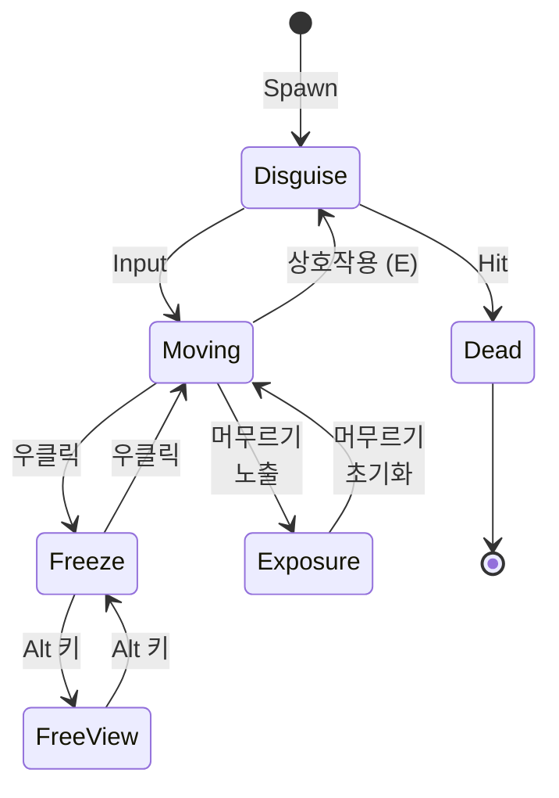

# VoxelHunt

  
  
  
  
  

 
고등학교 재학 중에 Unity로 개발한 <b>멀티플레이 사물 숨바꼭질 게임 프로젝트</b>입니다. 

 

**최소 2명**부터 **최대 10명**까지, 다양한 복셀 사물로 변장하여 숨는 복셀팀과  
숨은 복셀들을 잡는 헌터팀으로 나뉘어 **숨바꼭질 추격전**을 즐기세요! 

 

### 개발 정보
+ 개발 기간 : 2020.04 ~ 2020.07
+ 개발 인원 : 3인
+ 지원 언어 : 한국어
+ 타겟 플랫폼 : Windows

 

기획 의도 - 코로나로 쉽게 나갈 수 없는 시대, 비대면 수업도 하는데 비대면으로 즐길 수 있는 것을 만들어보자!

 

## 프로젝트 팀원 (BUILD PROJECT)
| 윤창범 | 정도근 | 박현우 
|:---:|:---:|:---:|
|  |  |  |
| **프로그래밍**   UI 디자인 | **복셀 모델링**   UI 디자인 | **복셀 모델링** |

 

## 개발 환경
+ Unity (2019.4.0f1)
+ MagicaVoxel
+ C#
+ Windows

 

## 수상 내역
| 타이틀 | 세부 내용 |  |
|:---:|:---:|:---:|
| 2020   Korea Wi-Content Contest   중고등부 IT 콘텐츠 부문 | 문화체육관광부장관 대상 수상작   (게임 제작) |  |
| 2020   제10회 전국 중.고교생   서강 게임/애니/만화 아이디어   공모전 (서강대학교) | 금상 수상작 | <a href="https://drive.google.com/drive/folders/15wYkqpB_sI_ziqTSYjB5MrNnT5sB_mXT?usp=sharing">`📜`</a> |
| 2020   IT분야 직업계고 취업 UP! 게임개발대회 | 서울시교육감   금상 수상작 | <a href="https://drive.google.com/drive/folders/15wYkqpB_sI_ziqTSYjB5MrNnT5sB_mXT?usp=sharing">`📜`</a> |
| 2020   부산인디커넥트   페스티벌 | 멀티플레이 부문   선정   &   수상작 |  |

 

## 주요 기술
| 기술 |  |
|:---:|:---|
| 싱글톤 패턴 | 싱글톤 구현으로 주요 매니저 클래스 관리   [VH_GameManager](https://github.com/dbsckdqja75/VoxelHunt/blob/main/Scripts/InGame/VH_GameManager.cs), [PhotonManager](https://github.com/dbsckdqja75/VoxelHunt/blob/main/Scripts/Static/PhotonManager.cs), [DataManager](https://github.com/dbsckdqja75/VoxelHunt/blob/main/Scripts/Static/DataManager.cs) 등 |
| **[Photon PUN2](https://assetstore.unity.com/packages/tools/network/photon-pun-2-120838)** | 포톤 네트워크 프레임워크 적용으로 실제 인게임 멀티플레이 환경 및 네트워크 로직 구현   [PUN2 & Chat] |
| 마스터   클라이언트   기반 제어 | `PhotonNetwork.IsMasterClient`를 활용한 권한 분리로   라운드 타이머, 팀 배정, 맵 프리셋 결정 등 핵심 게임 제어 로직 처리 |
| CustomProperties   동기화 | `Room/Player CustomProperties`와 `Hashtable`을 활용하여 라운드 정보, 플레이어 정보, 룸 옵션 등   실시간으로 동기화 및 합류 플레이어 처리 대응 |
| RPC 기반   실시간 상호작용 | `PunRPC` 처리로 사물 변신, 타격 판정 아이템 사용 처리 등   클라이언트 간 즉각적인 이벤트 전파 제어 |
| Anti-Cheat | AntiCheatManager를 통한 비정상적인 값 변조, 스피드핵 감시 및   암호화된 변수 관리 구조 적용 |
| 사운드 관리 | [SoundManager](https://github.com/dbsckdqja75/VoxelHunt/blob/main/Scripts/Static/SoundManager.cs) 구현으로 인게임의 배경음악 및 효과음 리소스 로드,   Coroutine 기반 Volume, CrossFade 제어 |

 

## 프로젝트 설계 구조 (다이어그램)
### 시스템 전체 구조

 

### 인게임 진행 흐름 구조

 

### 네트워크 데이터 통신 구조 (RPC)

 

### 플레이어 로직 구조

시스템 로직의 대부분은 **싱글톤 패턴**으로 구현한 중앙 집중형 매니저에 **매우 의존하는 구조**입니다. 

초기에는 프로토타입으로 간단한 설계 구조로 진행되었으나, 여러 공모전 일정으로 기한 내의  
급한 수정과 컨텐츠 확장에 맞추어 작업을 진행하여 **대부분의 클래스가 하드코딩된 설계와 높은 결합도**를 가진 상태입니다. 

 

## 기술적 이슈와 아쉬운 점
+ **하드코딩 설게** 
> 여러 레이어 이름과 각종 태그와 키값까지 리터럴 형태로 작성하여서 점점 수정이 어려워졌던 문제가 있었음

 

+ **높은 결합도 구조** 
> 흡사 God Object라고 봐도 무방할 정도로 주요 핵심 클래스에 책임과 의존도가 과하게 집중되어서   개발 막바지에는 상당 시간이 확장과 수정 과정에서 소요되었음

 

+ **네트워크 관련 예외 이슈 대응** 
> 같이 게임을 시작했으나 늦게 로딩되어 동기화가 제대로 되지 않거나, 도중 합류 유저의 동기화 처리와 관련하여   간헐적 이슈가 있었는데 현재 설계상 통째로 리팩토링 하지 않는 이상 쉽게 고칠 수 없는 문제라 판단하여   작업하 못했던 큰 아쉬움이 있음

 

## 트레일러 & 플레이 영상

  
  

 

## 기타 정보
+ 저장소에는 프로젝트의 원본 소스코드만 포함되어 있습니다.
+ 파티클 이펙트와 사운드 효과음은 유료 에셋을 수정 및 활용하였으며,   **배경음악은 [저작권자](https://www.youtube.com/channel/UCps63j3krzAG4OyXeEyuhFw)에게 직접 이메일 연락을 통해 사용 허락을 받고** 활용하여 사용했습니다.   (비상업용/공모전 출품 활용 목적)

 

## 게임 다운로드
### <a href="https://github.com/dbsckdqja75/VoxelHunt/releases/latest/download/VoxelHunt_Build_220508.zip">Github 배포 파일 (Windows)</a>
### <a href="https://drive.google.com/file/d/1Qu0O9G4wWUON8brQ4CGJTBoNPAUBa8-5/view?usp=sharing">GoogleDrive 배포 파일</a>

